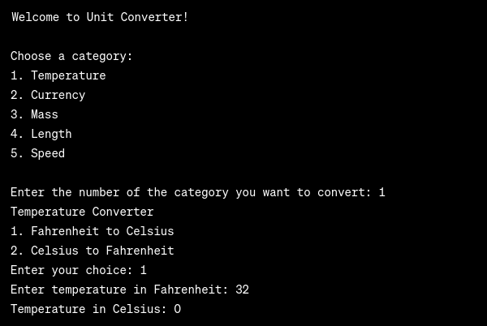

# Unit Converter

Welcome to the Unit Converter repository! This simple C program allows users to convert values between different units in categories such as temperature, currency, mass, length, and speed.

## Table of Contents

- [Unit Converter](#unit-converter)
  - [Table of Contents](#table-of-contents)
  - [Features](#features)
  - [Getting Started](#getting-started)
    - [Prerequisites](#prerequisites)
    - [Installation](#installation)
  - [Usage](#usage)
  - [Contributing](#contributing)
  - [License](#license)

## Features

- Temperature conversion (Fahrenheit to Celsius and vice versa)
- Currency conversion (USD to Euro, JPY, and NRP)
- Mass conversion (Ounces to Pounds and Grams to Pounds)
- Length conversion (Inches to Feet)
- Speed conversion (Miles per hour to Kilometers per hour)

## Getting Started

### Prerequisites

- Ensure you have a C compiler installed on your system (e.g., GCC).

### Installation

1. Clone the repository to your local machine:

   ``bash
   git clone https://github.com/srijankarki07/Basic-Unit-Converter.git
   ``

2. Navigate to the project directory:

   ``bash
   cd unit-converter
   ``

3. Compile the C program:

   ``bash
   gcc unit_converter.c -o unit_converter
   ``

## Usage

1. Run the compiled program:

   ``bash
   ./unit_converter
   ``

2. Follow the on-screen prompts to choose a category and perform conversions.

## Contributing

Contributions are welcome! If you have ideas for improvements, bug fixes, or new features, please open an issue or submit a pull request.

## License

This project is licensed under the MIT License - see the [LICENSE](LICENSE) file for details.

##Ouput
